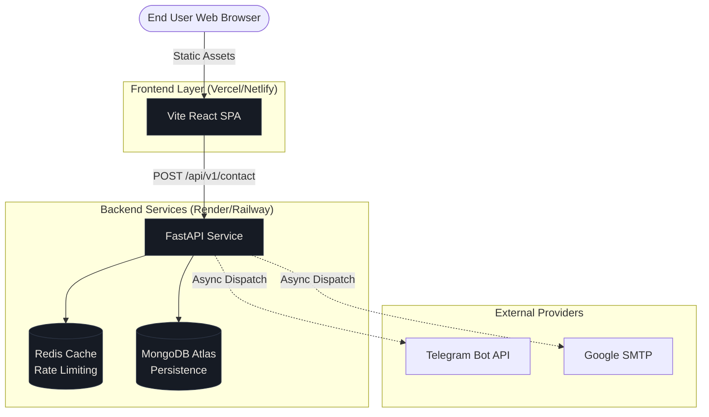

# Fredrick Nyang'au – Backend Engineering Portfolio


A production-grade portfolio designed specifically for backend engineers. It demonstrates clean architecture, technical storytelling, and real-world system integration.

## Architecture Overview

This project is structured as a mono-repo containing two distinct applications:

1. **Frontend (`/`)**: A React Single Page Application (SPA) built with Vite and TailwindCSS v4. It features a technical, terminal-inspired aesthetic and is prerendered for SEO.
2. **Backend (`/backend`)**: A FastAPI microservice handling asynchronous contact form submissions with dual-dispatch notifications (Telegram + SMTP), MongoDB persistence, and Redis-backed rate limiting.



## Key Engineering Features

- **Decoupled Architecture**: Frontend and backend are completely separate. The frontend can be hosted on edge networks (Vercel/Netlify) while the backend runs as a Dockerized microservice.
- **Asynchronous Processing**: The contact endpoint immediately returns `201 Created` and offloads email/Telegram dispatch to FastAPI background tasks.
- **Fault Tolerance**: The API degrades gracefully. If MongoDB or Redis go down, the API still processes the request and dispatches notifications via network transit.
- **Rate Limiting**: Protects against spam using Redis, strictly limiting requests per IP address.
- **Prerendering**: The Vite frontend uses `vite-plugin-prerender` to generate static HTML for the case study pages, ensuring perfect SEO for crawlers that don't execute JavaScript.

---

## Local Development Setup

### 1. Frontend Development

Requirements: Node.js (v20+)

```bash
# Install dependencies
npm ci

# Start the Vite development server on port 5174
npm run dev

# Build for production (includes prerendering)
npm run build
```

### 2. Backend Development

Requirements: Python 3.12+, Docker (for Redis)

The backend has a dedicated `Makefile` to simplify local development.

```bash
cd backend

# Start local Redis for rate limiting
docker run -d -p 6379:6379 --name portfolio_redis redis:alpine

# Create virtual environment and install dependencies
python3 -m venv .venv
source .venv/bin/activate
pip install -r requirements/base.txt
pip install -r requirements/development.txt

# Start the FastAPI server on port 8080
make dev

# Run the test suite
make test
```

> **Note**: You must configure the `.env` file in the `backend/` directory before starting the server. Copy `.env.example` to `.env` and fill in your MongoDB Atlas and SMTP credentials.

---

## Content Configuration

The portfolio content is strictly typed and decoupled from the UI components. To update your portfolio, simply modify the data files located in `src/data/`:

- `projects.ts`: Your featured engineering case studies.
- `stack.ts`: Your technical skills categorized by backend domains.
- `philosophy.ts`: Your core engineering principles.
- `experience.ts`: Your timeline of achievements.
- `writing.ts`: Your published technical articles.

## Deployment

### Frontend
Deploy the root directory to Vercel, Netlify, or Cloudflare Pages. The build command is `npm run build` and the output directory is `dist`.

### Backend
The backend includes a highly optimized, multi-stage `Dockerfile`.
Deploy the `backend/` directory to Render, Railway, or AWS ECS. Ensure you set all the required environment variables outlined in `backend/.env.example`.

---
> "Building production-grade APIs for East Africa's mobile-first economy."
